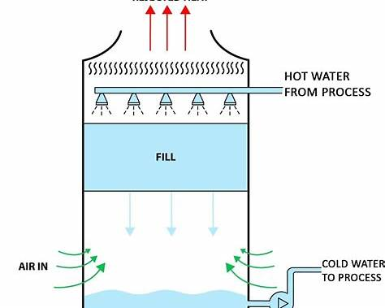
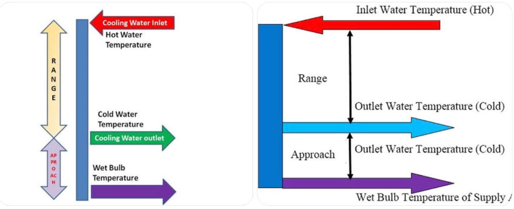

# How cooling tower works

## 1️⃣ Overall cooling tower flow (big picture)

### Step-by-step explanation (plain language)

1. **Hot water enters the tower (from chillers or process)**

    * This water picked up heat from servers (data center) or HVAC systems (hospital).
    * It is *not* cooled yet — it is carrying unwanted heat.

2. **Water is distributed at the top**

    * Spray nozzles or distribution basins spread water evenly.
    * This maximizes surface area so heat can escape.

3. **Water flows downward over “fill”**

    * Fill looks like plastic sheets or honeycomb structures.
    * Purpose: **slow the water and increase air–water contact**.

4. **Air is pulled upward by a fan**

    * The fan creates airflow in the opposite direction of falling water.
    * This airflow causes **evaporation**.

5. **Evaporation removes heat**

    * A small amount of water evaporates.
    * Evaporation pulls heat from the remaining water.
    * This is the *actual cooling mechanism*.

6. **Cooled water collects in the basin**

    * This water is now cooler.
    * Pumps send it back to chillers/process to absorb heat again.

🔁 This cycle runs continuously.

---

## 2️⃣ Role of the fan (why airflow matters)

### What the fan does

* Pulls **warm, moist air out** of the tower
* Draws **fresh ambient air in**
* Maintains evaporation rate

### What problems look like in data

| Fan issue        | What sensors show                     |
|------------------|---------------------------------------|
| Fan failure      | Fan speed = 0, rising cold water temp |
| Poor airflow     | Fan speed ↑ but approach ↑            |
| Mechanical issue | Vibration ↑, bearing temp ↑           |

---

## 3️⃣ Pumps and water circulation

### Pump flow

* **Condenser water pump** moves hot water → tower
* **Gravity** moves water downward inside tower
* **Return pump** sends cooled water back

### Why flow matters

* Too little flow → poor heat removal
* Too much flow → insufficient contact time

---

## 4️⃣ Wet-bulb temperature (most misunderstood concept)

### Simple explanation

* **Wet-bulb temperature = how cool air can get by evaporation**
* It depends on:

    * Air temperature
    * Humidity

### Key rule (VERY IMPORTANT)

> **A cooling tower can NEVER cool water below the wet-bulb temperature**

---

## 5️⃣ Approach & Range (how engineers judge performance)

### Definitions

| Term         | Formula         | Meaning      |
|--------------|-----------------|--------------|
| **Range**    | Hot − Cold      | Heat removed |
| **Approach** | Cold − Wet-bulb | Efficiency   |

### What good vs bad looks like

| Condition            | Interpretation              |
|----------------------|-----------------------------|
| Low approach (5–7°F) | Healthy tower               |
| Rising approach      | Fouling / airflow / scaling |
| High approach        | Immediate attention         |

📌 **This is why your system monitors “approach” so heavily**

---

## 6️⃣ Where sensors fit into the diagram

### Typical sensor placement

* Hot water temp → inlet pipe
* Cold water temp → basin outlet
* Conductivity, pH → basin
* Fan speed & vibration → motor
* Wet-bulb → nearby weather station

---

## 7️⃣ How this maps directly to your analytics system

| Physical part  | Data you collect  | Analytics use      |
|----------------|-------------------|--------------------|
| Hot water line | Hot water temp    | Load               |
| Basin          | Cold water temp   | Performance        |
| Atmosphere     | Wet-bulb          | Normalization      |
| Fan            | Speed, vibration  | Mechanical health  |
| Water          | Conductivity, ORP | Scaling & bio risk |

---

## Summary

* Cooling towers cool water by **evaporation**
* **Wet-bulb temperature sets the limit**
* **Approach is the most important metric**
* Fans and fill enable evaporation
* Chemistry keeps the system from destroying itself

